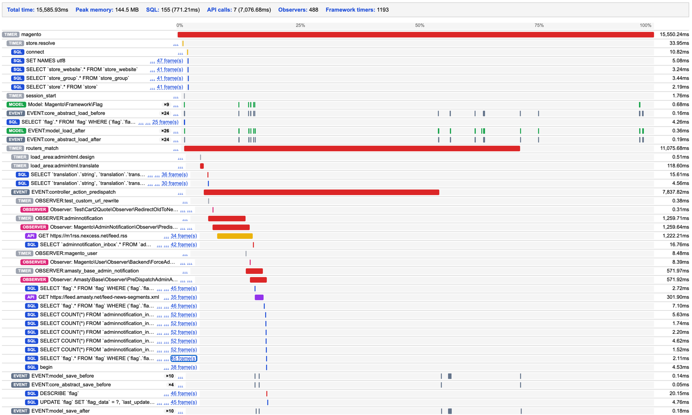

# Goomento_SystemTraces

**Goomento_SystemTraces** is a lightweight, zero-admin-config **request profiler and performance
debugging tool for Magento 2 and Adobe Commerce**. It's a developer toolbar / devbar alternative that
needs no configuration screens: every request gets a single, self-contained HTML report merging **SQL
query profiling**, **external HTTP/API call tracing**, **observer and event profiling**, and Magento's
own framework phase timers (controller dispatch, layout build, block render, model/collection loads)
into one chronological waterfall - similar in spirit to what New Relic, Blackfire, or Xdebug's profiler
give you, but self-hosted, dependency-free, and scoped specifically to Magento internals.

[](LICENSE)
[](https://magento.com)
[](composer.json)



## Use cases

Reach for this module when you need to:

- **Debug slow Magento pages** - find which SQL query, API call, or observer is actually eating the
  request's time budget, without attaching Xdebug or standing up an APM.
- **Profile SQL queries** - spot N+1 query patterns, duplicate queries, and slow queries with full
  backtraces, without enabling Magento's built-in `dev:profiler:enable` output.
- **Trace observer and event performance** - see exactly which observers ran, for which event, and how
  long each one took - not just that "some observer" was slow.
- **Audit third-party module overhead** - a merged, chronological view makes it obvious which installed
  module's code is contributing time to a request.

## Features

- **One report, one page** - no admin config screens, no multi-tab UI to click through.
- **Chronological waterfall** - every SQL query, API call, observer, and framework timer placed on a
  shared time axis, nested under whatever triggered it.
- **Repeats collapsed, not hidden** - an event firing hundreds of times (e.g. `core_layout_block_create_after`
  once per block) collapses into a single row with a count badge, but still renders one tick per real
  occurrence so you can see how they're spread across the request.
- **No admin config** - a plain `env.php` in the module root, not `core_config_data`. Edit it, save it,
  no cache to flush.

## Requirements

- Magento 2.4+
- PHP 7.4, 8.1, 8.2, or 8.3

## Installation

Copy this module into `app/code/Goomento/SystemTraces`, then:

```bash
bin/magento module:enable Goomento_SystemTraces
bin/magento setup:upgrade
```

No further setup is required - reports start generating on the next request.

## Configuration

Edit `env.php` (in the module root). `env.php` is gitignored -
your local settings never conflict with pulls or upgrades.

| Key | Default | Description |
| --- | --- | --- |
| `enabled` | `true` | Master switch for tracing and report generation. |
| `url_pattern` | `'*'` | Only build a report for requests whose path matches this `fnmatch()` pattern (e.g. `'/catalog/product/*'`). |
| `report_path_mode` | `'folder'` | `'folder'` mirrors the request path as nested directories under `var/system_traces/`; `'flat'` writes every report into one directory with the path flattened into the filename. |

If `env.php` is missing entirely, these defaults apply - the module works out of the box.

The only other on/off switch is the module itself:

```bash
bin/magento module:disable Goomento_SystemTraces
```

## Output

Reports are written to `var/system_traces/`, one timestamped HTML file per request. Each file is fully
self-contained (inline CSS, no JavaScript, no external assets) - open it directly in a browser.

## How it works

A `FrontControllerInterface` plugin schedules report generation via `register_shutdown_function`, so it
runs after the real response has already been sent to the client. Along the way, a set of plugins record
what happened during the request:

- A custom `Zend_Db_Profiler` subclass, installed on the DB adapter, captures every SQL query with a
  backtrace.
- A custom `Magento\Framework\Profiler\DriverInterface` driver records every framework `Profiler::start()`/
  `stop()` call with its real start time (unlike Magento's own driver, which only keeps cumulative
  time/count).
- Plugins on `HTTP\ClientInterface`, `HTTP\Adapter\Curl`, and `Event\InvokerInterface` (observers) time
  those calls the same way.

`Service\Timeline` merges all of it into one chronologically-sorted list, and `Service\ReportGenerator`
renders it into the standalone HTML file.

## Known limitations

This module traces by intercepting specific Magento framework classes, not by monkey-patching PHP
itself - anything that bypasses those classes is invisible to it:

- **HTTP calls** are only traced when made through `Magento\Framework\HTTP\ClientInterface`
  (`Client\Curl`, `Client\Socket`) or `Magento\Framework\HTTP\Adapter\Curl`. A module that calls
  `curl_exec()` directly, instantiates `GuzzleHttp\Client` itself, uses
  `Magento\Framework\HTTP\AsyncClientInterface`, `LaminasClient`/`ZendClient` on a non-curl adapter, or
  uses `file_get_contents()`/`fsockopen()` for HTTP, will not show up in the report at all.
- **SQL queries** are only traced on the connection(s) Magento's own `ResourceConnection` manages. A
  module opening its own PDO/mysqli connection directly bypasses this.
- **Observers** are only traced through Magento's standard event dispatch (`InvokerInterface`). Code
  that calls an observer's `execute()` method directly, without going through event dispatch, isn't
  captured.

If a report seems to be missing time (the sum of visible rows is much less than the total request
duration), the gap is very likely happening in one of these bypassed paths.

## License

MIT - see [LICENSE](LICENSE).
